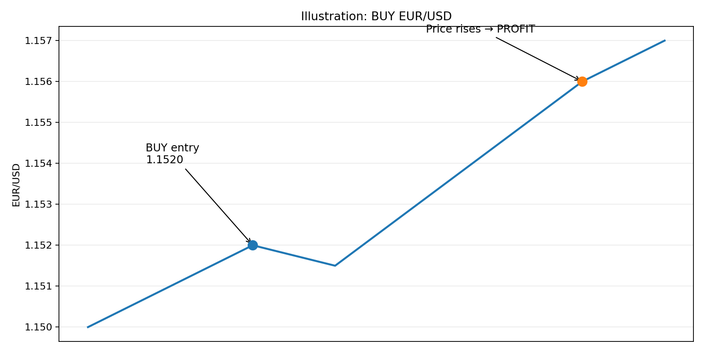
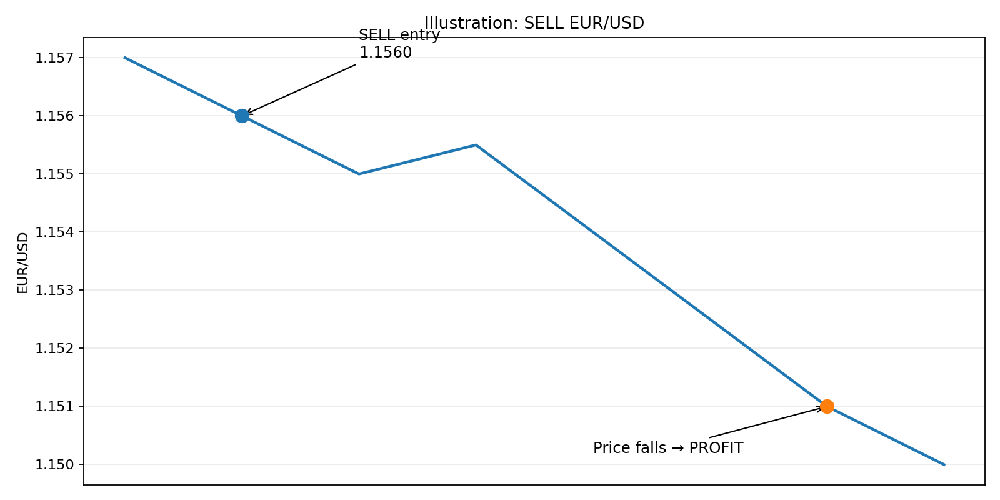

# BUY at SELL sa Forex: EUR/USD

## Ang pinakaimportanteng idea

Kung ang **EUR/USD** ay nasa **1.1520**, ang ibig sabihin ay:

> **1 EUR = 1.1520 USD**

Kapag nag-trade tayo ng EUR/USD, ang tanong ay hindi lang *“Bibili ba ako ng EUR?”*

Ang mas mahalagang tanong ay:

> **“Saan ko inaasahang pupunta ang presyo — pataas o pababa?”**

- **BUY** → umaasa kang **tataas** ang EUR/USD.
- **SELL** → umaasa kang **bababa** ang EUR/USD.

---

## 1. Ano ang BUY?

Kapag nag-**BUY EUR/USD** ka, ang basic idea ay:

> **“Sa tingin ko tataas ang presyo ng EUR kumpara sa USD.”**

Halimbawa:

**BUY @ 1.1520**

Pagkatapos ay umakyat ang presyo:

**1.1520 → 1.1560**

Pabor sa iyo ang galaw.

**BUY + presyo pataas = PROFIT**



### Bakit?

Bumili ka sa mas mababang presyo at ang position mo ay nagkaroon ng mas mataas na market price.

Kung isinara mo ang trade sa 1.1560:

**1.1560 − 1.1520 = 0.0040**

Dahil ang karaniwang pip sa EUR/USD ay **0.0001**:

**0.0040 ÷ 0.0001 = 40 pips**

Kaya ang trade ay nagkaroon ng **+40 pips**, bago isaalang-alang ang spread, commission, at iba pang trading costs.

---

## 2. Ano naman ang SELL?

Ito ang madalas nakakalito sa umpisa:

> **“Paano ako kikita sa SELL kung bumababa ang presyo?”**

Dahil sa forex, maaari kang kumuha ng **short position**.

Ang basic idea:

> **“Sa tingin ko bababa ang EUR/USD.”**

Halimbawa:

**SELL @ 1.1560**

Pagkatapos ay bumaba:

**1.1560 → 1.1510**

Pabor sa iyo ang pagbaba.

**SELL + presyo pababa = PROFIT**



Kung isinara mo ang trade sa 1.1510:

**1.1560 − 1.1510 = 0.0050**

**0.0050 ÷ 0.0001 = 50 pips**

Kaya ang trade ay nagkaroon ng **+50 pips**, bago isaalang-alang ang trading costs.

---

# 3. Isang rule na madaling tandaan

| Order | Gusto mong mangyari | Kapag nangyari |
|---|---|---|
| **BUY** | Presyo ↑ | PROFIT |
| **BUY** | Presyo ↓ | LOSS |
| **SELL** | Presyo ↓ | PROFIT |
| **SELL** | Presyo ↑ | LOSS |

O ganito lang:

> 🟢 **BUY = gusto mong umakyat.**  
> 🔴 **SELL = gusto mong bumaba.**

---

# 4. Pero bakit may BUY at SELL sa isang currency pair?

Ang EUR/USD ay **isang pair ng dalawang currency**:

- **EUR** = base currency
- **USD** = quote currency

Kapag:

**EUR/USD = 1.1520**

ibig sabihin:

**1 EUR = 1.1520 USD**

### Kapag BUY EUR/USD

Conceptually:

> **BUY EUR + SELL USD**

### Kapag SELL EUR/USD

Conceptually:

> **SELL EUR + BUY USD**

Kaya ang BUY at SELL ay laging may relasyon sa **dalawang currency**.

---

# 5. Ano ang ibig sabihin kapag tumataas ang EUR/USD?

Halimbawa:

**1.1520 → 1.1600**

Ibig sabihin, ang 1 EUR ay nagkakahalaga na ngayon ng **1.1600 USD**.

Mas maraming USD ang kailangan para sa isang EUR.

Sa simpleng trading interpretation:

> **Lumakas ang EUR relative sa USD.**

Kaya kung BUY ka mula 1.1520, pabor sa iyo ang galaw.

---

# 6. Ano naman kapag bumababa ang EUR/USD?

Halimbawa:

**1.1520 → 1.1450**

Ngayon, 1 EUR ay katumbas na lamang ng 1.1450 USD.

Mas kaunting USD ang katumbas ng isang EUR.

Sa simpleng trading interpretation:

> **Humina ang EUR relative sa USD.**

Kaya kung SELL ka mula 1.1520, pabor sa iyo ang galaw.

---

# 7. Ang magandang mental picture

Kapag tumingin ka sa chart, isipin mo muna:

> **“Kung papasok ako ngayon, gusto ko bang umakyat o bumaba ang presyo?”**

Kung:

**“Gusto kong umakyat.”**

→ **BUY**

Kung:

**“Gusto kong bumaba.”**

→ **SELL**

Hindi pa nito sinasabi kung *tama* ang prediction mo. Direction lang ang pinipili mo.

---

# 8. BUY example

Sabihin nating:

**BUY EUR/USD @ 1.15713**

At umakyat ang presyo sa:

**1.15813**

Difference:

**1.15813 − 1.15713 = 0.00100**

At:

**0.00100 = 10 pips**

Kaya:

**BUY → +10 pips**

---

# 9. SELL example

Ngayon baligtarin natin.

**SELL EUR/USD @ 1.15713**

At bumaba ang presyo sa:

**1.15613**

Difference:

**1.15713 − 1.15613 = 0.00100**

At:

**0.00100 = 10 pips**

Kaya:

**SELL → +10 pips**

Mapapansin mo:

> Parehong maaaring kumita ng 10 pips ang BUY at SELL.

Ang kaibahan ay **magkaiba ang direksyong kailangan ng presyo**.

---

# 10. Paano naman kung mali ang direction?

### BUY pero bumaba

**BUY @ 1.15713**

Presyo:

**1.15713 → 1.15613**

= **−10 pips**

Loss.

### SELL pero umakyat

**SELL @ 1.15713**

Presyo:

**1.15713 → 1.15813**

= **−10 pips**

Loss.

Kaya hindi ang BUY o SELL mismo ang nagbibigay ng profit.

Ang nagbibigay ng profit ay:

> **Tamang direction + sapat na favorable price movement.**

---

# 11. Saan pumapasok ang Stop Loss?

Parehong puwedeng lagyan ng **Stop Loss (S/L)** ang BUY at SELL.

### BUY

Kung:

**BUY @ 1.15713**

at ayaw mong lumampas sa isang partikular na loss, maaaring ilagay ang S/L **sa ibaba** ng entry.

Halimbawa:

**S/L = 1.15613**

Kapag umabot doon ang presyo, maaaring ma-close ang position ayon sa execution conditions ng broker.

### SELL

Kung:

**SELL @ 1.15713**

maaaring ilagay ang S/L **sa itaas** ng entry.

Halimbawa:

**S/L = 1.15813**

Kapag umakyat hanggang doon, maaaring ma-close ang position.

---

# 12. At ang Take Profit?

Baligtad naman ang logic.

### BUY

BUY @ 1.15713

Kung target mo ang:

**1.15913**

gusto mong **umakyat** ang presyo papunta sa target.

### SELL

SELL @ 1.15713

Kung target mo ang:

**1.15513**

gusto mong **bumaba** ang presyo papunta sa target.

---

# 13. BUY at SELL sa isang tingin

```text
                    EUR/USD PRICE
                         ↑
                         │
        BUY             │       PROFIT
   ─────────────────────●────────────────
        Entry           │
                         │
                         │
─────────────────────────┼────────────────→
                         │
        Entry           │
   ─────────────────────●────────────────
        SELL             │       PROFIT
                         │
                         ↓
```

Mas madaling isipin ito bilang:

```text
BUY  → gusto mong PRICE ↑
SELL → gusto mong PRICE ↓
```

---

# 14. Huwag munang isipin ang BUY/SELL bilang “tama o mali”

Ang BUY at SELL ay **trade direction** lamang.

Ang tunay na challenge sa forex ay:

1. Saan papasok?
2. Anong direction?
3. Gaano kalaki ang position?
4. Saan ang Stop Loss?
5. Saan ang Take Profit?
6. Magkano ang posibleng loss?
7. Magkano ang posibleng profit?

Kaya hindi sapat na sabihin:

> **“BUY ako kasi mukhang aakyat.”**

Kailangan ding malaman:

> **“Kung mali ako, magkano ang handa kong mawala?”**

---

# 15. At dito pumapasok ang lot size

Halimbawa, pareho kang nakakuha ng:

**+10 pips**

Pero:

- Trade A = **0.01 lot**
- Trade B = **0.10 lot**

Hindi pareho ang dollar profit nila.

Kaya mahalagang paghiwalayin sa isip ang:

**Direction → Pips → Lot Size → Money**

Ang BUY/SELL ay nagsasabi ng **direction**.

Ang pips ay nagsasabi kung gaano kalayo ang gumalaw.

Ang lot size naman ang malaking factor sa kung gaano kalaki ang epekto nito sa account.

---

# 16. Ang isang sentence na dapat kabisado

> **BUY EUR/USD kung ang expectation mo ay tataas ang EUR/USD. SELL EUR/USD kung ang expectation mo ay bababa ang EUR/USD.**

At kapag malinaw na ito, mas madaling maintindihan ang susunod na concepts:

**PIP → LOT SIZE → SPREAD → PROFIT/LOSS → STOP LOSS → TAKE PROFIT → MARGIN**

---

## Importanteng paalala

Ang BUY o SELL ay **hindi garantiya ng profit**.

Ang BUY ay hindi nangangahulugang siguradong tataas ang market.

Ang SELL ay hindi nangangahulugang siguradong bababa ang market.

Ang mga ito ay paraan lamang para pumili ng **direction ng position**.

Ang goal ng trader ay magkaroon ng trade setup kung saan ang **potential reward** at **potential risk** ay malinaw bago pumasok.
