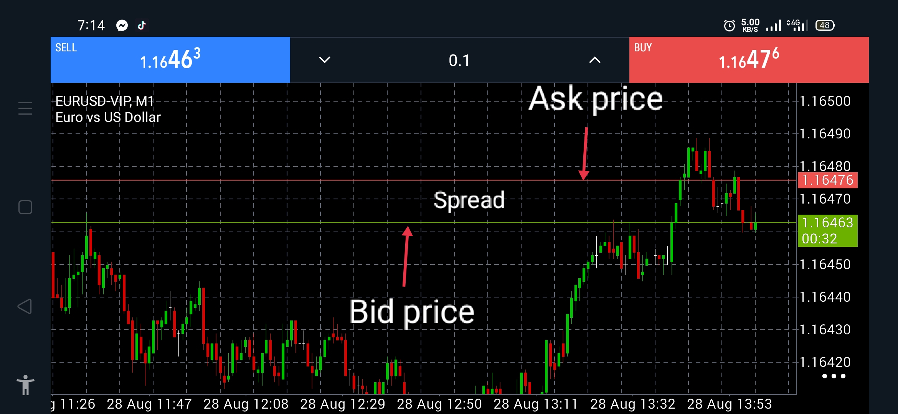
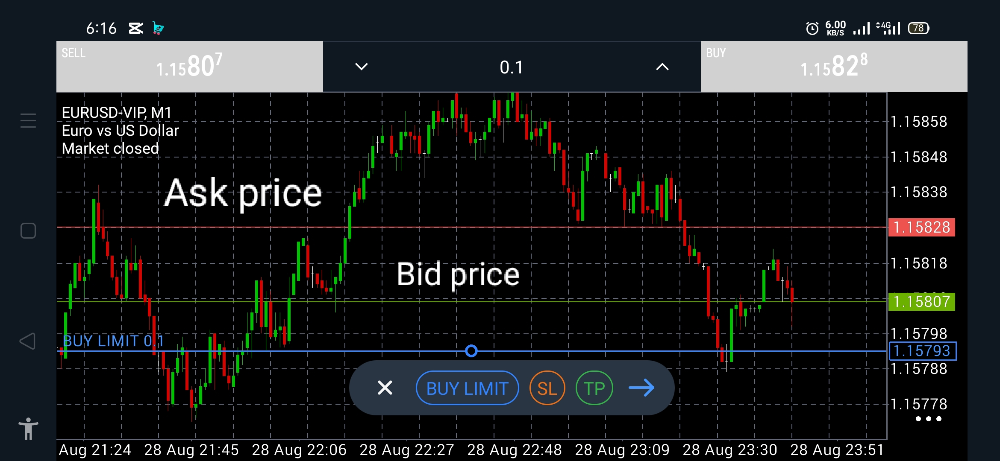
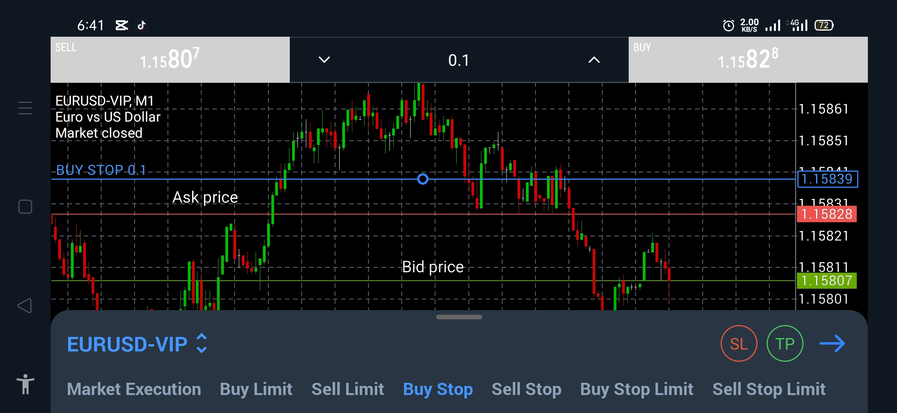
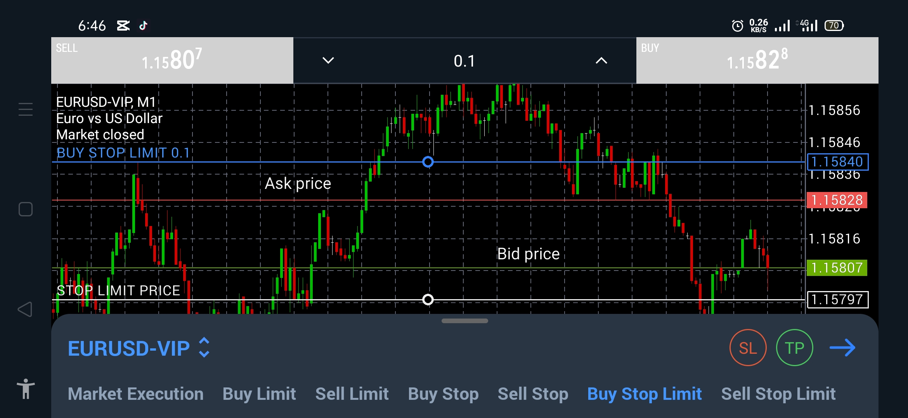
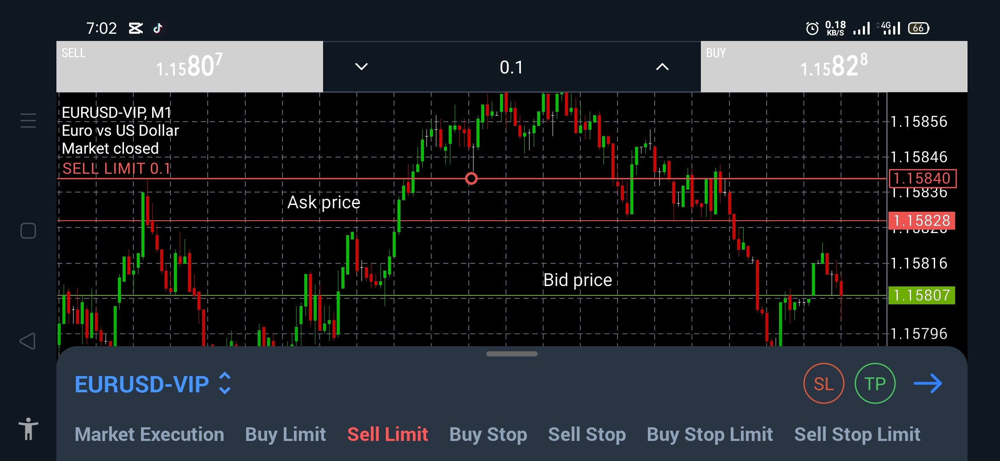
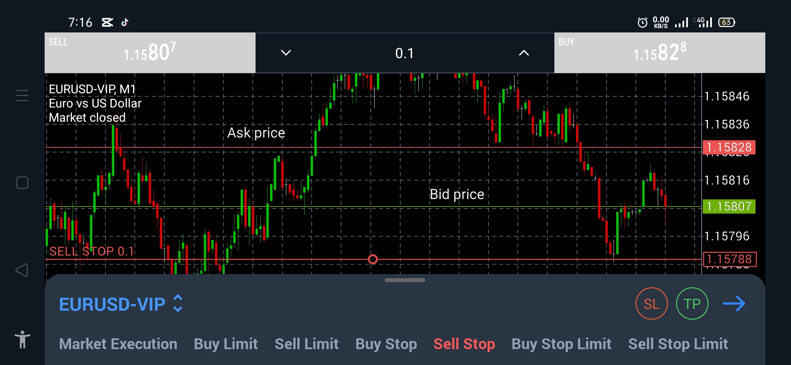

# ORDERS

May dalawang pangunahing uri ng orders:

- **Market Orders**
- **Pending Orders**

---

## MARKET ORDERS

Ang market order ay isang order na **ine-execute agad** sa kasalukuyang available market price.

May dalawang presyo sa market:

- **Ask Price** — presyo kung saan bumibili ang trader.
- **Bid Price** — presyo kung saan nagbebenta ang trader.

### BUY

Kapag nag-**BUY** ka, ang ginagamit na presyo para ma-execute ang order ay ang **Ask Price**.

Parang sinasabi mo:

> “Naniniwala ako na tataas pa ang presyo, kaya bibili ako ngayon sa kasalukuyang Ask Price.”

Kapag na-execute na ang BUY order, **OPEN na agad ang trade**.

### SELL

Kapag nag-**SELL** ka, ang ginagamit na presyo para ma-execute ang order ay ang **Bid Price**.

Parang sinasabi mo:

> “Naniniwala ako na bababa pa ang presyo, kaya magse-SELL ako ngayon sa kasalukuyang Bid Price.”

Kapag na-execute na ang SELL order, **OPEN na agad ang trade**.

---

# PENDING ORDERS

Sa pending order, **hindi pa agad nagiging OPEN trade** ang order.

Nagtatakda ka muna ng isang price level na kailangang maabot bago ito ma-execute.

Sa madaling salita:

> **Pending Order → naghihintay muna ng tamang presyo → saka magiging OPEN trade.**

## BUY Pending Orders

Para sa BUY pending orders, **Ask Price** ang ginagamit na reference sa pag-trigger.

May tatlong uri:

### 1. BUY Limit

Dito ay pumipili ka ng **mas mababang price** kumpara sa kasalukuyang Ask Price.

Halimbawa:

Current Ask = **1.15828**

BUY Limit = **1.15793**

Kapag bumaba ang **Ask Price** hanggang 1.15793:

→ Ma-e-execute ang BUY Limit  
→ Magiging **OPEN BUY trade**

Parang sinasabi mo:

> “Gusto kong bumili, pero gusto ko munang bumaba ang presyo.”

**BUY Limit = Bumaba muna → BUY**

---

### 2. BUY Stop

Dito ay pumipili ka ng **mas mataas na price** kumpara sa kasalukuyang Ask Price.

Halimbawa:

Current Ask = **1.15828**

BUY Stop = **1.15840**

Kapag umakyat ang **Ask Price** hanggang 1.15840:

→ Ma-e-execute ang BUY Stop  
→ Magiging **OPEN BUY trade**

Parang sinasabi mo:

> “Kapag umakyat na hanggang sa level na ito, saka ako bibili.”

**BUY Stop = Umakyat muna → BUY**

---

### 3. BUY Stop Limit

Ang **BUY Stop Limit** ay may **dalawang price level**:

1. **Stop Price** → trigger/pang-trigger
2. **Limit Price** → presyo ng actual BUY Limit order

Halimbawa:

Current Ask = **1.15828**

Stop Price = **1.15840**

Limit Price = **1.15797**

Ang gusto mong mangyari:

> “Kapag umakyat muna sa 1.15840, saka ako maghihintay na bumaba sa 1.15797 bago bumili.”

### Step-by-step

**①** Umaakyat ang presyo:

1.15828 → 1.15830 → 1.15840

**②** Pagdating ng Ask Price sa **1.15840**:

→ Na-trigger ang BUY Stop Limit.

Pero **hindi ka pa agad nakakabili.**

Sa puntong ito, ang system ay maglalagay ng **BUY Limit order sa 1.15797**.

**③** Kung bumaba ang presyo:

1.15840 → 1.15828 → 1.15797

→ Ma-e-execute ang BUY Limit  
→ Magiging **OPEN BUY trade**

**④** Kung hindi bumaba at tuloy-tuloy na umakyat:

1.15840 → 1.15850 → 1.15860

→ Hindi ma-e-execute ang BUY Limit  
→ Wala pang OPEN trade.

### Madaling tandaan:

**BUY Stop Limit = Akyat muna sa STOP → hintay ng baba sa LIMIT → BUY**

---

# SELL Pending Orders

Para sa SELL pending orders, **Bid Price** ang ginagamit na reference sa pag-trigger.

May tatlong uri:

### 1. SELL Limit

Dito ay pumipili ka ng **mas mataas na price** kumpara sa kasalukuyang Bid Price.

Halimbawa:

Current Bid = **1.15807**

SELL Limit = **1.15840**

Kapag umakyat ang **Bid Price** hanggang 1.15840:

→ Ma-e-execute ang SELL Limit  
→ Magiging **OPEN SELL trade**

**SELL Limit = Umakyat muna → SELL**

---

### 2. SELL Stop

Dito ay pumipili ka ng **mas mababang price** kumpara sa kasalukuyang Bid Price.

Halimbawa:

Current Bid = **1.15807**

SELL Stop = **1.15788**

Kapag bumaba ang **Bid Price** hanggang 1.15788:

→ Ma-e-execute ang SELL Stop  
→ Magiging **OPEN SELL trade**

**SELL Stop = Bumaba muna → SELL**

---

### 3. SELL Stop Limit

Ito naman ang **kabaligtaran ng BUY Stop Limit**.

May dalawang price level:

1. **Stop Price** → trigger/pang-trigger
2. **Limit Price** → presyo ng actual SELL Limit order

Halimbawa:

Current Bid = **1.15807**

Stop Price = **1.15600**

Limit Price = **1.15650**

Ang gusto mong mangyari:

> “Kapag bumaba muna sa 1.15600, saka ako maghihintay na umakyat sa 1.15650 bago mag-SELL.”

### Step-by-step

**①** Bumaba ang presyo:

1.15700 → 1.15650 → 1.15600

**②** Pagdating ng Bid Price sa **1.15600**:

→ Na-trigger ang SELL Stop Limit.

Pero **hindi ka pa agad nagse-SELL**.

Maglalagay ang system ng **SELL Limit order sa 1.15650**.

**③** Kung umakyat ang presyo:

1.15600 → 1.15620 → 1.15650

→ Ma-e-execute ang SELL Limit  
→ Magiging **OPEN SELL trade**

**④** Kung hindi umakyat at tuloy-tuloy na bumaba:

1.15600 → 1.15500 → 1.15400

→ Hindi ma-e-execute ang SELL Limit  
→ Wala pang OPEN trade.

### Madaling tandaan:

**SELL Stop Limit = Baba muna sa STOP → hintay ng taas sa LIMIT → SELL**

---

# QUICK SUMMARY

| Order | Presyo kumpara sa current price | Kapag naabot | Resulta |
|---|---|---|---|
| **BUY Limit** | Mas mababa | Ask | BUY |
| **BUY Stop** | Mas mataas | Ask | BUY |
| **SELL Limit** | Mas mataas | Bid | SELL |
| **SELL Stop** | Mas mababa | Bid | SELL |
| **BUY Stop Limit** | Stop mas mataas, Limit mas mababa | Ask reaches Stop | Naglalagay ng BUY Limit |
| **SELL Stop Limit** | Stop mas mababa, Limit mas mataas | Bid reaches Stop | Naglalagay ng SELL Limit |

---

# SPREAD

Ang **Spread** ay ang pagitan ng **Ask Price** at **Bid Price**.

**Ask − Bid = Spread**

Halimbawa:

Ask = **1.15713**

Bid = **1.15703**

Spread = **0.00010 = 1 pip**

Ang spread ay may katumbas na monetary value depende sa **lot size**.

Para sa typical EUR/USD-type pair:

- **0.01 lot ≈ $0.10/pip**
- **0.10 lot ≈ $1.00/pip**
- **1.00 lot ≈ $10.00/pip**

### Bakit parang may loss agad pag-open ng trade?

Kapag nag-BUY ka, pumapasok ka sa **Ask Price**, pero kung isasara mo agad ang BUY, sa **Bid Price** ito iko-close.

Dahil mas mababa ang Bid kaysa Ask, karaniwang may **floating loss na humigit-kumulang katumbas ng spread cost** sa mismong pagbukas ng trade.

Ganito rin sa SELL, pero baligtad ang presyo:

**BUY:**
- Open → Ask
- Close → Bid

**SELL:**
- Open → Bid
- Close → Ask

Kaya mahalaga ang spread sa trading.

---

# FLOATING P/L AT REALIZED P/L

Habang **OPEN** pa ang trade, ang profit o loss ay tinatawag na:

**Floating P/L** o **Unrealized P/L**

Hindi pa ito final dahil maaari pang magbago ang presyo.

Kapag **CLOSED** na ang trade:

- Floating profit → magiging **Realized Profit**
- Floating loss → magiging **Realized Loss**

At ang resulta ng closed trade ay maibibilang na sa iyong **account balance**.

### Pinakasimpleng konsepto:

**Pending Order**  
↓  
*Naghihintay ng presyo*

**Order Triggered / Executed**  
↓  
**OPEN Trade**  
↓  
*Floating / Unrealized P/L*

**Trade Closed**  
↓  
**Realized Profit / Loss**
